# 📝 Guía de Karma GAP

## 🔍 Proof-of-Ship

Proof-of-Ship es el programa mensual de Celo que premia la ejecución efectiva: rastrea automáticamente tu actividad (commits en GitHub, publicaciones en Farcaster, entregables de grants) y la convierte en cUSD (hasta ~5 000 cUSD) directo a tu wallet. Todo queda registrado on-chain como prueba de entrega y fortalece tu reputación para futuras rondas de financiamiento y airdrops.

## 📘 Karma GAP

Karma GAP (Grantee Accountability Protocol) funciona como un "portafolio vivo" on-chain: un único perfil donde registras hitos, actualizaciones y entregables de tu proyecto. Este historial público y verificable facilita a financiadores y comunidades evaluar tu progreso, reduce la fricción en nuevos procesos de funding y mejora la transparencia general.

## 📑 Índice

1. [🚀 Inicio de sesión y registro](#-1-inicio-de-sesión-y-registro)
2. [📂 Creación de un nuevo proyecto](#-2-creación-de-un-nuevo-proyecto)
3. [🗂️ Información general del proyecto](#️-3-información-general-del-proyecto)
4. [🌐 Redes sociales (opcional)](#-4-redes-sociales-opcional)
5. [📈 Etapa del proyecto](#-5-etapa-del-proyecto)
6. [📧 Información de contacto](#-6-información-de-contacto)
7. [👥 Integrantes del equipo](#-7-integrantes-del-equipo)
8. [🔗 Aplicar a Proof-of-Ship y crear hitos](#-8-aplicar-a-proof-of-ship-y-crear-hitos)
9. [💰 Navegar a la pestaña de Funding](#-9-navegar-a-la-pestaña-de-funding)
10. [🎯 Seleccionar comunidad y programa de financiamiento](#-10-seleccionar-comunidad-y-programa-de-financiamiento)
11. [📋 Crear milestones](#-11-crear-milestones)
12. [🔐 Autorizar y completar milestones](#-12-autorizar-y-completar-milestones)
13. [📚 Recursos y próximos pasos](#-13-recursos-y-próximos-pasos)

---

## 🚀 1. Inicio de sesión y registro

Sigue estos pasos para conectar tu cuenta en Karma GAP:

1. Navega a `https://gap.karmahq.xyz/`.
2. Haz clic en **Login/Registro**.

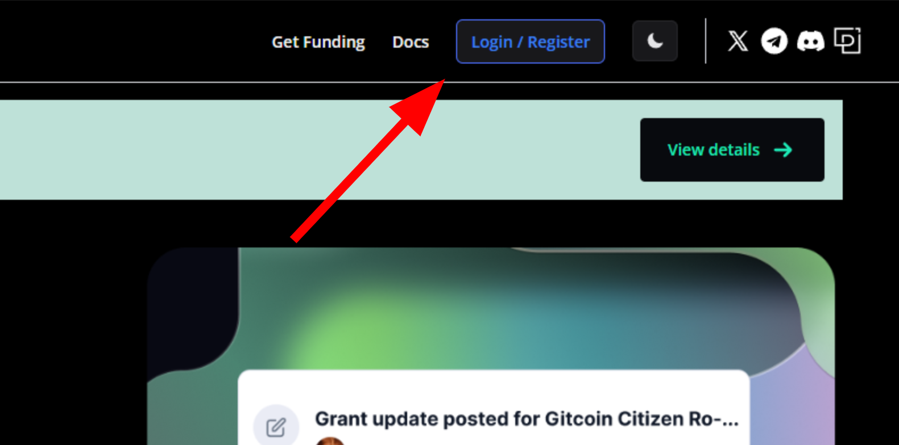

*Figura 1. Botón para iniciar sesión o registrarse.*
3. Selecciona tu wallet preferida y conecta.

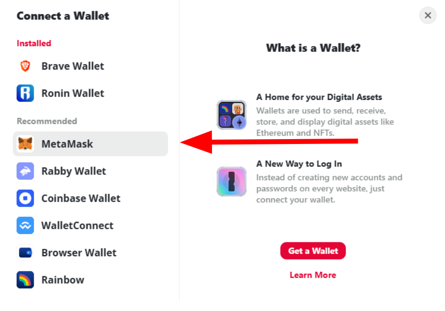

*Figura 2. Ventana para conectar tu wallet.*

> **Tip:** Si es tu primera vez, verás un mensaje de bienvenida sin proyectos registrados.

---

## 📂 2. Creación de un nuevo proyecto

Tras conectar tu wallet:

1. Haz clic en **Add Project**.

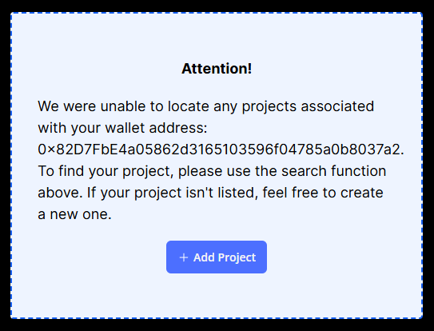

*Figura 3. Botón para iniciar el registro de un proyecto.*
2. Observa los pasos del proceso (seis en total).

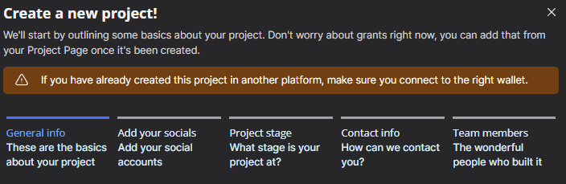

*Figura 4. Secuencia de pasos para crear un proyecto.*

---

## 🗂️ 3. Información general del proyecto

Completa los datos básicos de tu proyecto:

1. Ingresa el **Nombre** y una **Breve descripción**.

*Figura 5. Campos para nombre y descripción del proyecto.*
2. Describe el **Problema** que resuelves y tu **Solución**.

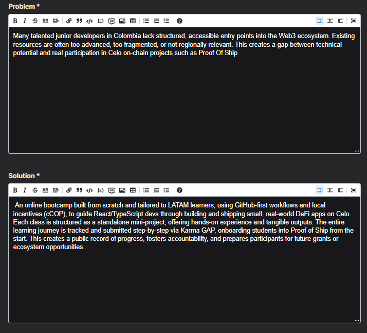

*Figura 6. Sección de problema y propuesta de valor.*
3. Detalla la **Misión** y el **Ámbito geográfico**.

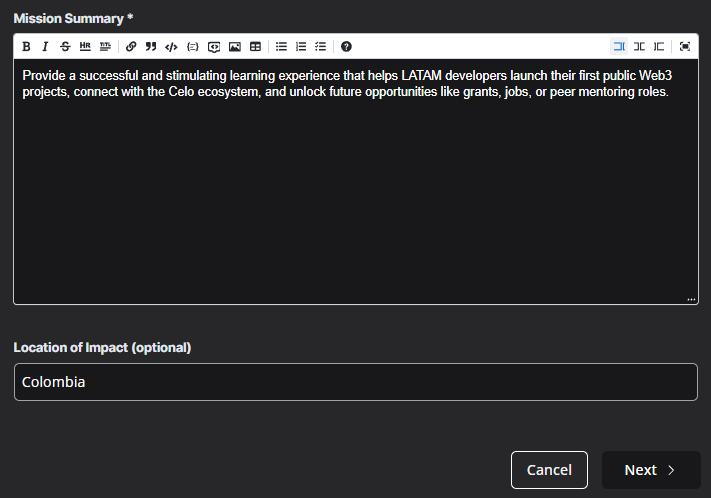

*Figura 7. Campo para la misión y área de impacto.*

---

## 🌐 4. Redes sociales (opcional)

Aumenta la visibilidad de tu proyecto proporcionando enlaces a tus perfiles:

* Twitter
* GitHub
* Página web oficial

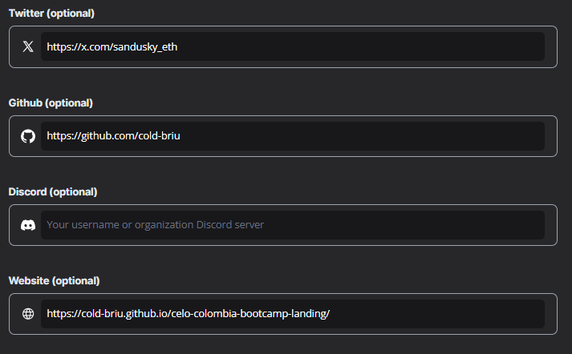

*Figura 8. Panel para redes sociales.*

---

## 📈 5. Etapa del proyecto

Indica en qué fase se encuentra tu proyecto y cuál es tu ruta de financiamiento:

1. **Modelo de negocio**.
2. **Nivel de desarrollo actual**.
3. **Fondos obtenidos** hasta la fecha.
4. **Objetivos de financiamiento**.

> **Nota:** Para proyectos sin ánimo de lucro, selecciona `Grants` como fuente principal.

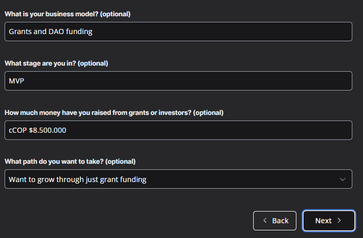

*Figura 9. Detalles de la etapa y financiamiento.*

---

## 📧 6. Información de contacto

Proporciona datos para recibir notificaciones sobre convocatorias y fechas límite:

* **Email institucional**
* **Número de teléfono** (opcional)

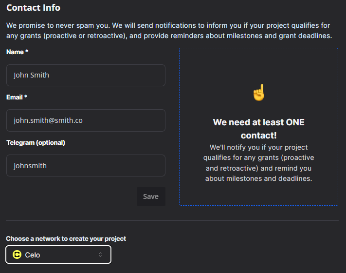

*Figura 10. Formulario de contacto.*

---

## 👥 7. Integrantes del equipo

Agrega las direcciones de los miembros del equipo para otorgarles acceso:

1. Ingresa cada dirección de wallet.
2. Verifica que todos aparezcan listados.

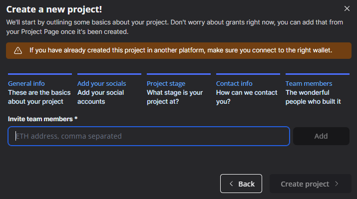

*Figura 11. Lista de participantes.*

---

## 🔗 8. Aplicar a Proof-of-Ship y crear hitos

1. En tu proyecto, haz clic en **Agregar fuente de fondeo**.
2. Selecciona **Proof-of-Ship**.
3. Crea tu primer **Hito** con título, descripción y fecha límite.
4. Firma la transacción.
5. Añade hitos adicionales según tu hoja de ruta.

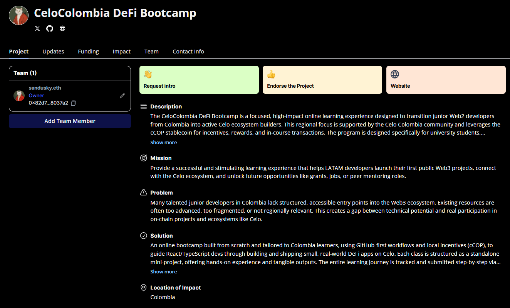

---

## 💰 9. Navegar a la pestaña de Funding

1. Localiza la pestaña **Funding** en tu proyecto.
2. Haz clic en **Add Funding**.

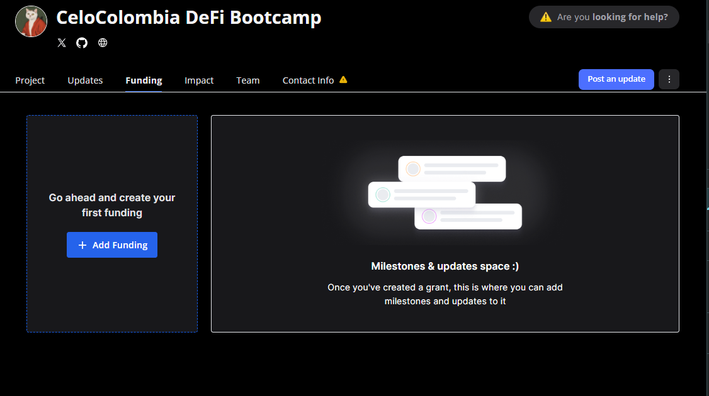

---

## 🎯 10. Seleccionar comunidad y programa de financiamiento

1. **Comunidad**: elige **Celo**.

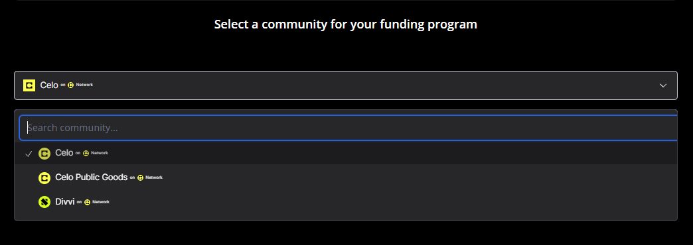

2. **Programa**: elige **Proof of Ship Temporada 6**.

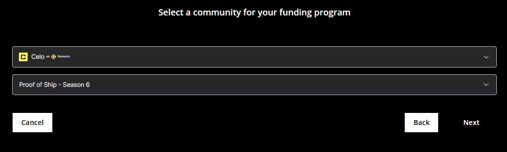

---

## 📋 11. Crear milestones

1. Haz clic en **Add Milestones**.
2. Completa el formulario:
   * **Título**
   * **Descripción** (opcional)
   * **End Date**
3. Haz clic en **Save Milestone** y firma.

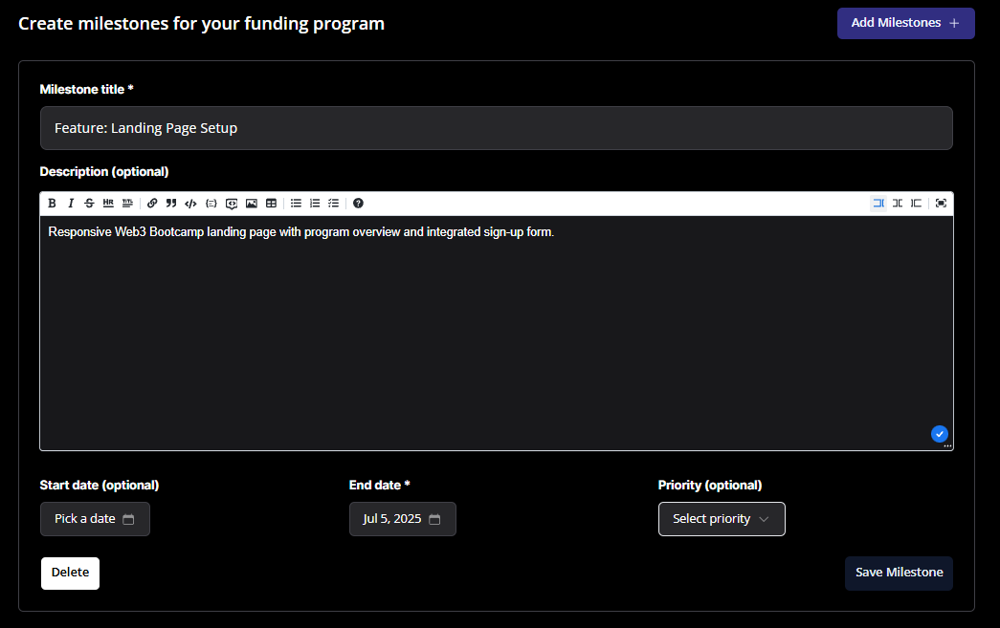

---

## 🔐 12. Verificar y agregar milestones adicionales

1. Una vez completada la firma, verifica que la fuente de financiamiento aparezca en tu perfil en la pestaña de funding.

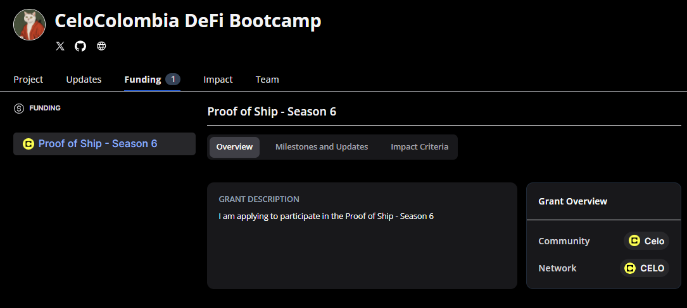

*Figura 20. Fuente de financiamiento agregada al perfil.*

2. Para crear milestones adicionales, haz clic en **Add New Milestone**.

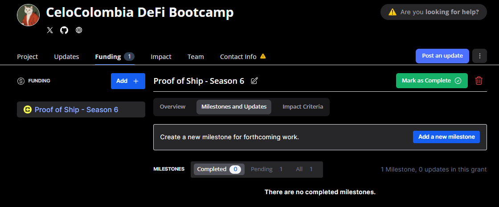

*Figura 21. Opción para agregar nueva milestone.*

3. Completa el formulario con la información de la nueva milestone y firma la transacción.

4. Verifica que todas las milestones aparezcan listadas en la pestaña de funding.

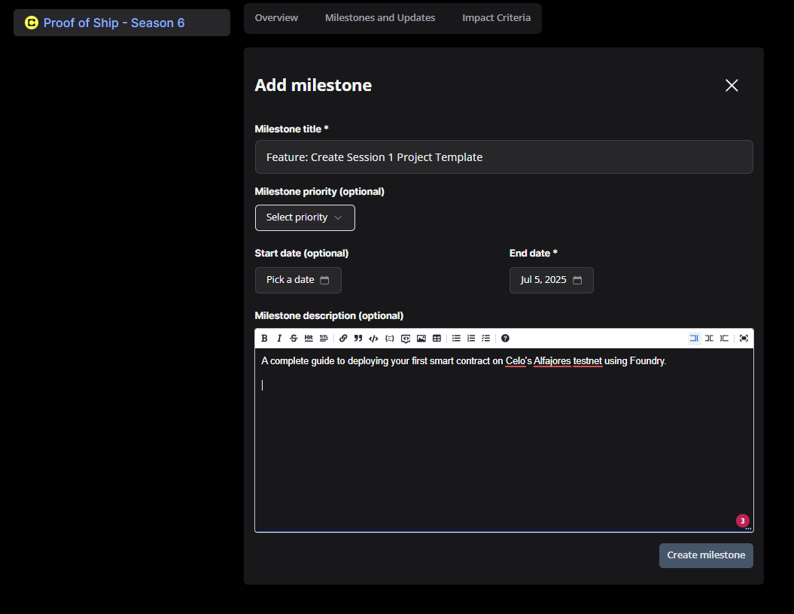

*Figura 22. Milestones creadas en la pestaña de funding.*

---

## 📚 13. Recursos y próximos pasos

* 📖 Consulta la [documentación oficial de Karma GAP](https://docs.karmahq.xyz/).
* 🔗 Integra GitHub y Farcaster para validaciones automáticas.
* 🚀 Empieza tu primer ciclo de hitos y comparte tu progreso en la comunidad.

