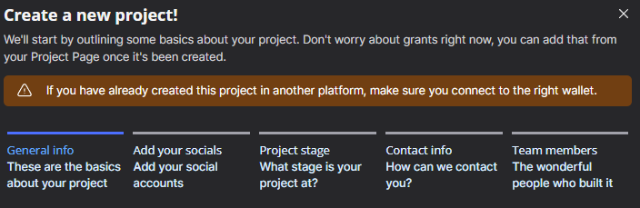
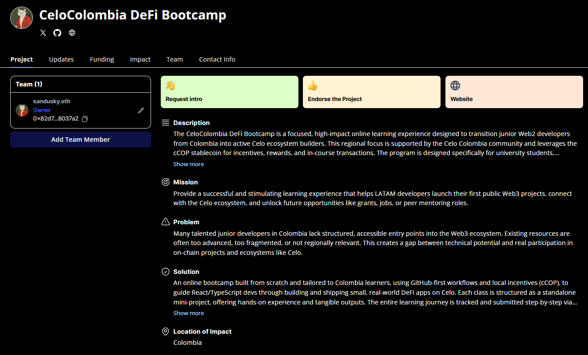

# Karma GAP

## ¿Qué es Karma GAP?

Karma GAP es una herramienta blockchain que permite a los programas de grants mantener claridad y transparencia mediante registros on-chain. Los equipos crean un perfil de proyecto, asocian sus grants y definen milestones sencillos. Cada actualización y logro queda registrado en la blockchain, de modo que cualquiera puede verificar el progreso sin permisos adicionales.

En el programa Proof-of-Ship de Celo, los builders se registran eligiendo un track y aportando detalles como enlaces de GitHub o direcciones de smart contract. Luego comparten sus avances en cada milestone, y las comprobaciones automáticas de Karma (vía GitHub y Farcaster) validan el trabajo y distribuyen las recompensas según los resultados. Así, todo el proceso es ágil, transparente y justo.

## Creando una cuenta en Karma GAP y registrando el primer proyecto

Con un fin educativo, esta guia muestra el proceso de registro especifico que se siguio para registrar este bootcamp en KarmaGAP.

En primer lugar, navegar al sitio de Karma GAP https://gap.karmahq.xyz/

Luego hcaer click en el boton "login/registro" 

Al hacer click en el boton de login registro, una ventana aparecera solicitando conectar la wallet, en este caso se elige la opcion de preferencia, sea wallet en el navegador o wallet desde el telefono

Una vez conectada la cuenta, la plataforma indica que no hay proyectos registrados, pues es la primera vez que se inicia sesion.
Para registrar el primer proyecto se debe presionar el boton de "add project"

El proceso de creacion de proyecto consta de 6 pasos, el primero requiere la informacion general del proyecto

### Informacion general del proyecto

El primer paso requiere ingresar el nombre del proyecto y su descripcion a resgos generales

Luego, describir el problema que se intenta resolver y como el proyecto soluciona o atiende a ese problema

Finalmente, se describe un resumen de la mision del proyecto, que enuncia de manera abstracta lo que se quiere lograr, tambien se incluye el area geografica donde tendra impacto el proyecto. Con esto, se completa la etapa de informacion general del proyecto

### Informacion de redes sociales 

A continuacion, se ingresa informacion sobre las redes sociales del proyecto, si bien es opcional, mejora la reputacion del proyecto de cara a posibles financiadores 

### Etapa del proyecto

El siguiente paso en el proceso de registro implica describir la situacion actual del proyecto, esto es, el modelo de negocio, la etapa de desarrollo, el financiamiento que ya se haya conseguido y la ruta de financiamiento que se busca.

En este caso, dado que este bootcamp es sin animo de lucro, su modelo de negocio es financiamiento de por medio de grants. 

### Informacion de contacto

En este paso se solicita informacion de contacto para notificar posibles grants que estén disponibles y para enviar altertas y notificaciones respecto a milestones y fechas límite. 

### Integrantes del equipo

El último requerimiento del registro consiste en agregar las direcciones de las personas que van a participar del equipo.

Habieno añadido las direcciones de los aprticipantes del equipo, se puede concluir con la fase de registro

